# Praktikum Sistem Operasi Modul 2

## Identitas
| Nama | NRP |
|------|-----|
|Dian Piramidiana Rachmatika | 5027251031 |

---

## Soal 1 - Kasbon Warga Kampung Durian Runtuh

### Penjelasan

Program `kasir_muthu.c` mengamankan data buku hutang secara otomatis menggunakan **Sequential Process** dengan kombinasi `fork()`, `exec()`, dan `waitpid()`.

Program menjalankan 4 langkah secara berurutan:
1. Membuat folder `brankas_kedai` menggunakan `mkdir`
2. Menyalin `buku_hutang.csv` ke dalam `brankas_kedai` menggunakan `cp`
3. Memfilter data berstatus **"Belum Lunas"** ke file `daftar_penunggak.txt` menggunakan `grep`
4. Mengompres `brankas_kedai` menjadi `rahasia_muthu.zip` menggunakan `zip`

Setiap langkah dijalankan oleh **child process (Ipin)** menggunakan `fork()` dan `execv()`, sementara **parent process (Upin)** menunggu child selesai menggunakan `waitpid()` sebelum melanjutkan ke langkah berikutnya. Jika ada langkah yang gagal (misalnya file tidak ditemukan), program langsung berhenti dan mencetak pesan error.

### Cara Menjalankan
```bash
# Compile program
gcc kasir_muthu.c -o kasir_muthu

# Jalankan program
./kasir_muthu
```

### Dokumentasi

**Screenshot 1 - Output saat berhasil**

Saat `./kasir_muthu` dijalankan dan semua langkah berhasil, akan muncul pesan sukses di terminal.

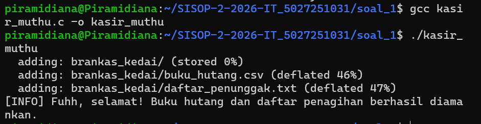

**Screenshot 2 - Isi daftar_penunggak.txt**

File `daftar_penunggak.txt` berisi semua data pelanggan yang berstatus "Belum Lunas" hasil filter `grep`.

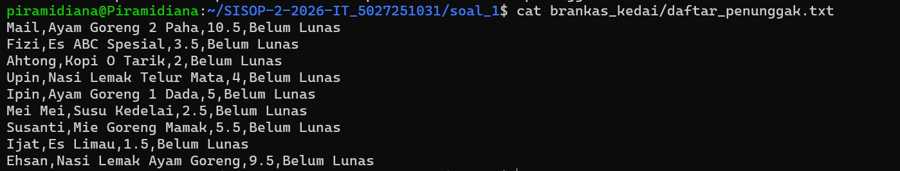

**Screenshot 3 - Output saat error**

Saat `buku_hutang.csv` dihapus lalu program dijalankan, program mendeteksi file tidak ada dan langsung berhenti dengan pesan error.

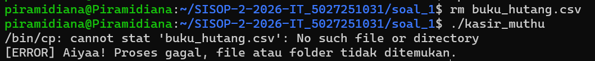

---

## Soal 2 - The world never stops, even when you feel tired

### Penjelasan

Program `contract_daemon.c` adalah **daemon process** yang berjalan di background secara terus menerus untuk memantau file `contract.txt`.

Cara kerja daemon:
1. Saat pertama dijalankan, membuat `contract.txt` berisi teks dan timestamp `created at`
2. Setiap **5 detik** menulis `still working... [status acak]` ke `work.log`. Status dipilih acak dari `[awake]`, `[drifting]`, `[numbness]`
3. Jika `contract.txt` **dihapus**, daemon membuat ulang file tersebut dalam 1-2 detik dengan timestamp `restored at`
4. Jika `contract.txt` **diubah isinya**, daemon menulis `contract violated.` ke log dan restore file
5. Saat daemon **dihentikan** dengan `kill`, menulis `We really weren't meant to be together` ke log

### Cara Menjalankan
```bash
# Compile program
gcc contract_daemon.c -o contract_daemon

# Jalankan daemon (terminal langsung kembali ke prompt karena daemon berjalan di background)
./contract_daemon

# Cek apakah daemon berjalan
ps aux | grep contract_daemon

# Matikan daemon (cari PID dari ps aux lalu kill)
kill $(ps aux | grep contract_daemon | grep -v grep | awk '{print $2}')
```

### Dokumentasi

**Screenshot 1 - Daemon berjalan**

Setelah `./contract_daemon` dijalankan, terminal langsung kembali ke prompt karena daemon berjalan di background. Perintah `ps aux | grep contract_daemon` digunakan untuk membuktikan daemon sedang berjalan dengan menampilkan PID-nya.

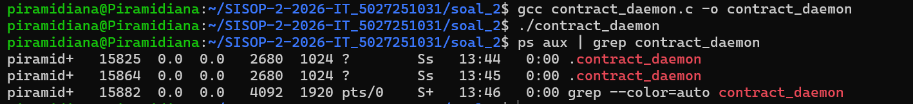

**Screenshot 2 - Isi contract.txt**

File `contract.txt` dibuat otomatis oleh daemon saat pertama kali dijalankan berisi teks janji dan timestamp `created at`.


**Screenshot 3 - Isi work.log (3 screenshot)**

Perintah `sleep 5 && cat work.log` digunakan untuk menunggu 5 detik lalu menampilkan isi work.log. Output sangat panjang karena daemon lama dari sesi sebelumnya masih berjalan dan belum dimatikan, sehingga log sudah menumpuk. Di dalam log juga terlihat perintah `kill`, `rm`, dan `./contract_daemon` karena daemon lama perlu dimatikan dan direstart.

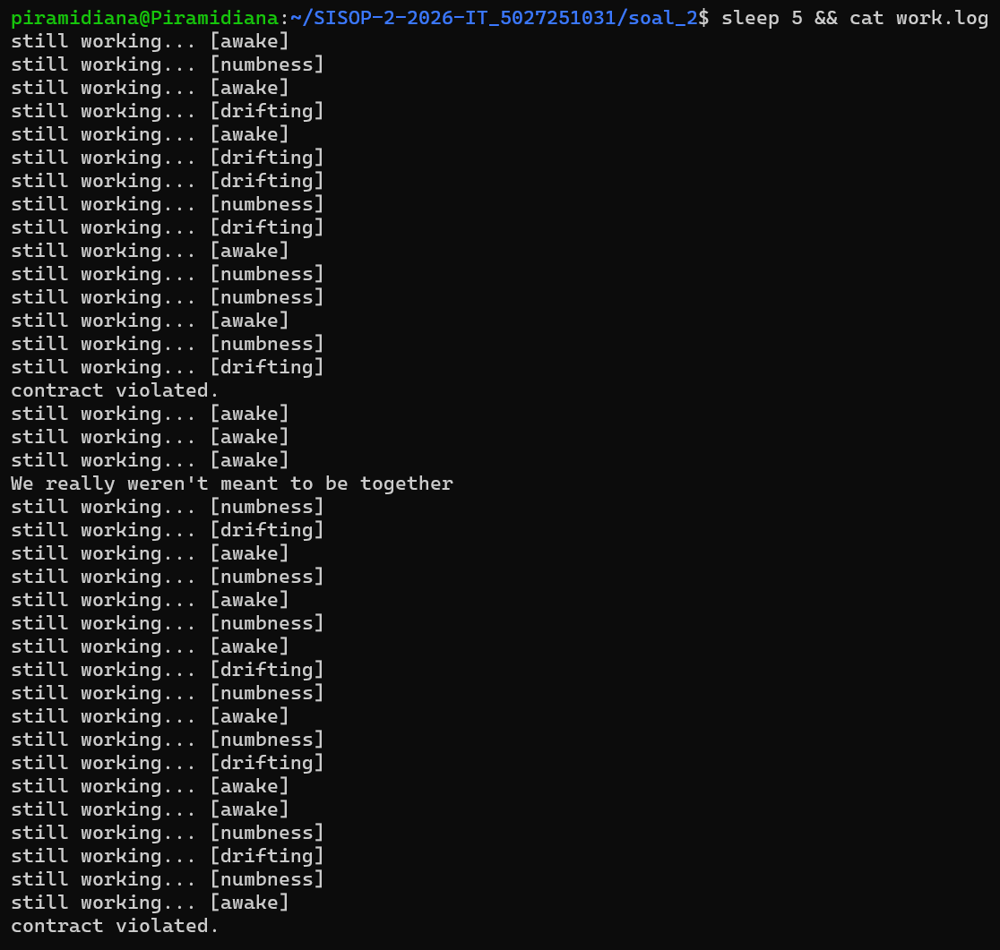
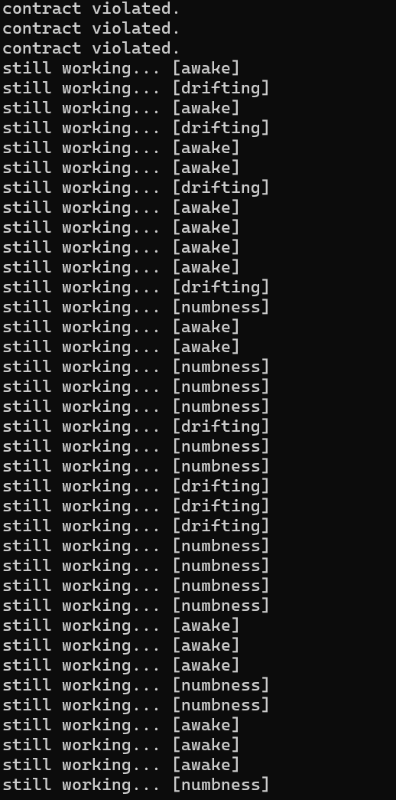
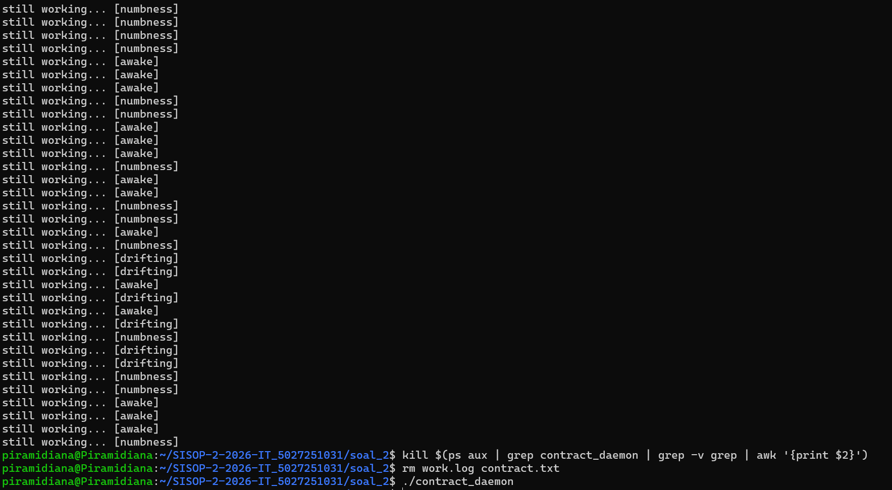

**Screenshot 4 - Test hapus contract.txt**

Perintah `rm contract.txt` menghapus file contract.txt. Setelah `sleep 2`, file dibuat ulang otomatis oleh daemon dengan timestamp `restored at` sebagai tanda file dipulihkan.

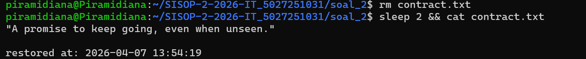

**Screenshot 5 - Test ubah contract.txt (2 screenshot)**

Perintah `echo "hacked" > contract.txt` mengubah isi contract.txt. Daemon mendeteksi perubahan dan menulis `contract violated.` ke work.log lalu restore file. Output panjang karena daemon sudah berjalan lama.

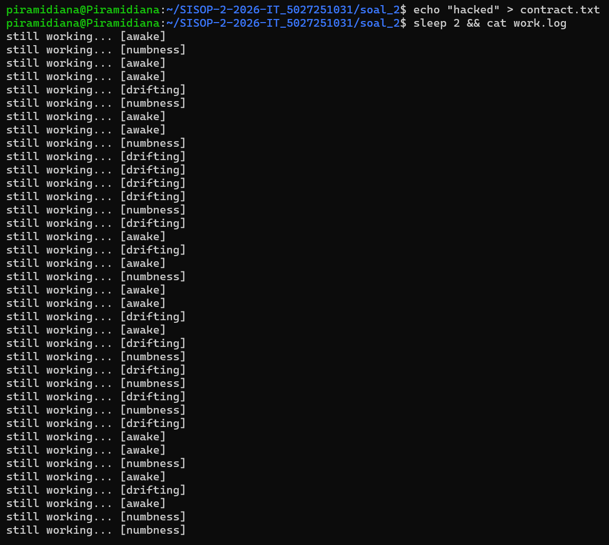
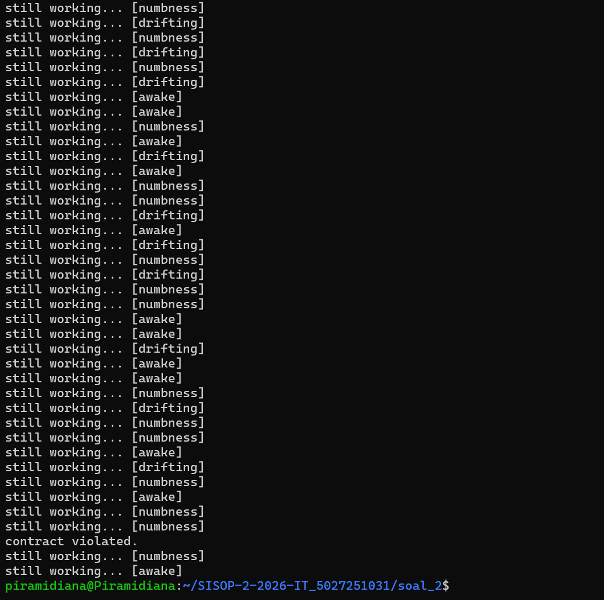

**Screenshot 6 - Matikan daemon (2 screenshot)**

Perintah `kill $(ps aux | grep contract_daemon | grep -v grep | awk '{print $2}')` digunakan untuk menghentikan daemon. Penjelasan perintah ini:
- `ps aux | grep contract_daemon` → mencari proses daemon
- `grep -v grep` → memfilter baris grep itu sendiri agar tidak ikut terkill
- `awk '{print $2}'` → mengambil kolom PID saja
- `kill` → mengirim sinyal SIGTERM ke PID tersebut

Setelah daemon dimatikan, `We really weren't meant to be together` muncul di baris terakhir work.log. Output panjang karena daemon sudah berjalan lama sebelum dimatikan.

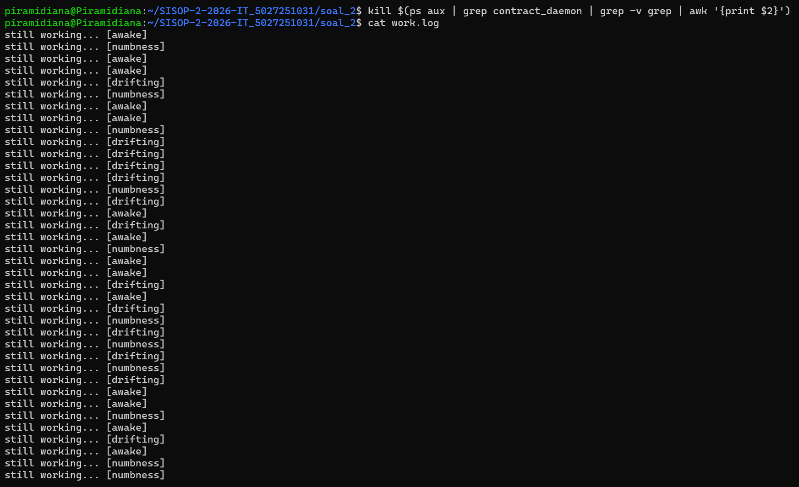
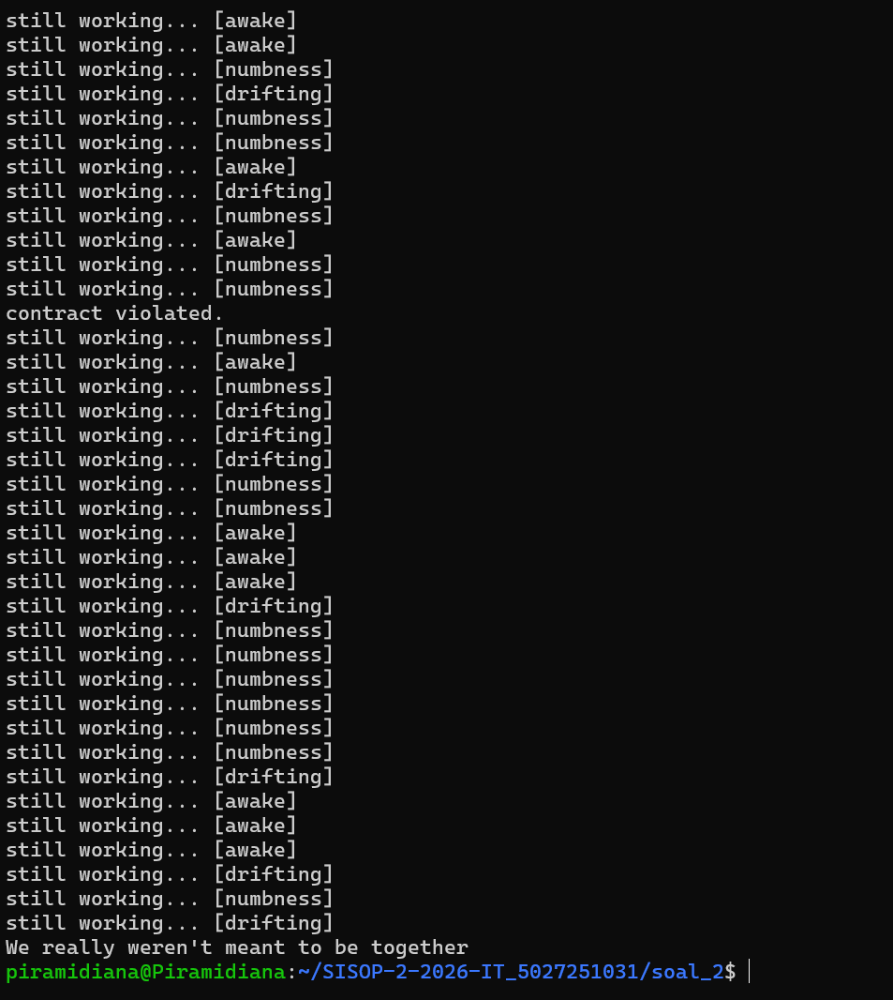

---

## Soal 3 - One letter for destiny

### Penjelasan

Program `angel.c` adalah **daemon process** dengan nama proses `maya` yang memiliki beberapa fitur:

- **Fitur secret**: Setiap 10 detik mengganti isi `LoveLetter.txt` dengan kalimat acak dari 4 pilihan
- **Fitur surprise**: Setelah fitur secret berjalan, mengenkripsi isi `LoveLetter.txt` menggunakan **Base64** sehingga tidak bisa dibaca langsung
- **Fitur decrypt**: Mendekripsi isi `LoveLetter.txt` dari Base64 dan menampilkan isi aslinya di terminal
- **Fitur kill**: Menghentikan daemon yang sedang berjalan menggunakan PID yang tersimpan di `/tmp/angel.pid`
- **Fitur logging**: Semua aktivitas dicatat ke `ethereal.log` dengan format `[dd:mm:yyyy]-[hh:mm:ss]_proses_STATUS`

### Cara Menjalankan
```bash
# Compile program
gcc angel.c -o angel

# Jalankan daemon (nama proses akan muncul sebagai "maya" di ps aux)
./angel -daemon

# Cek daemon berjalan dengan nama "maya"
ps aux | grep maya

# Decrypt LoveLetter.txt (menampilkan isi asli yang sudah dienkripsi)
./angel -decrypt

# Matikan daemon
./angel -kill
```

### Dokumentasi

**Screenshot 1 - Daemon berjalan dengan nama maya**

Setelah `./angel -daemon` dijalankan, terminal langsung kembali ke prompt. Perintah `ps aux | grep maya` membuktikan daemon berjalan dengan nama proses `maya` bukan `angel`, sesuai requirement soal.

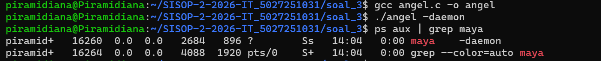

**Screenshot 2 - Isi LoveLetter.txt terenkripsi**

Setelah menunggu 10 detik dengan `sleep 10`, fitur secret sudah menulis kalimat acak ke LoveLetter.txt dan fitur surprise langsung mengenkripsinya dengan Base64. Isi file terlihat seperti karakter acak yang tidak bisa dibaca langsung.

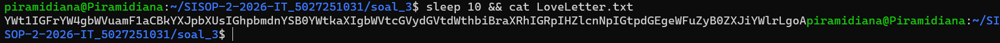

**Screenshot 3 - Hasil decrypt**

Perintah `./angel -decrypt` mendekripsi isi LoveLetter.txt dan menampilkan kalimat aslinya di terminal. Decrypt dipanggil beberapa kali karena kalimat berganti setiap 10 detik.

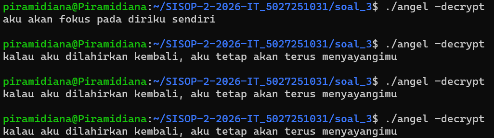

**Screenshot 4 - Isi ethereal.log**

File `ethereal.log` mencatat semua aktivitas daemon. Output sangat panjang karena daemon lupa dimatikan dari sesi sebelumnya sehingga log sudah menumpuk banyak. Format log: `[dd:mm:yyyy]-[hh:mm:ss]_nama-proses_STATUS`

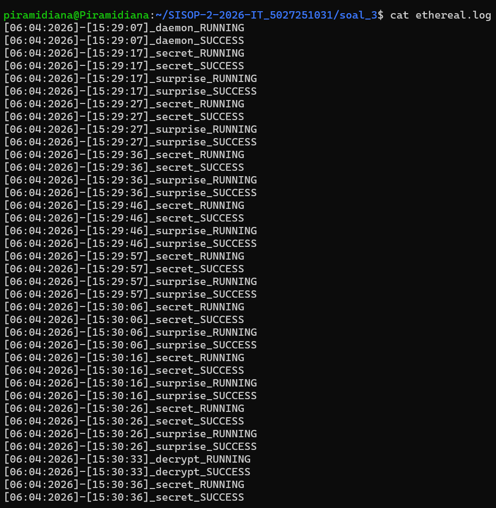

**Screenshot 5 - Matikan daemon**

Perintah `./angel -kill` menghentikan daemon. Berbeda dengan soal 2, soal 3 menggunakan `-kill` sebagai argumen karena PID daemon disimpan di file `/tmp/angel.pid` sehingga tidak perlu mencari PID manual. Setelah dimatikan, `kill_SUCCESS` muncul di baris terakhir ethereal.log.

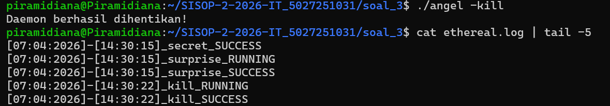
